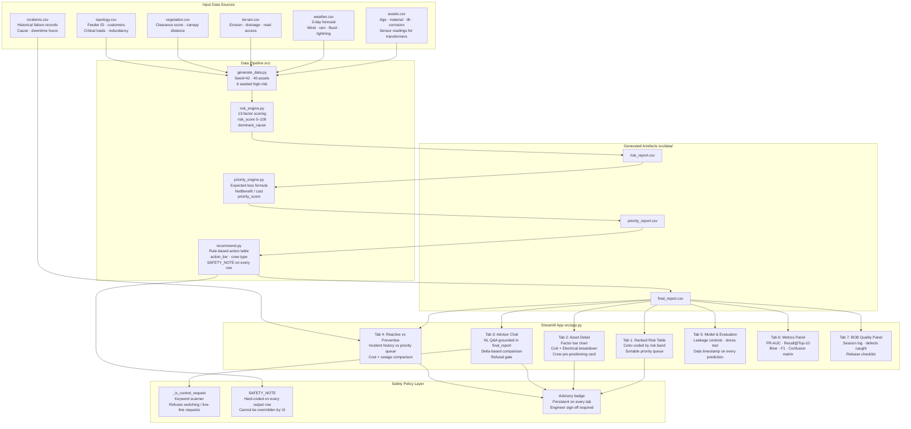

# docs/architecture.md — GridShield

## Data Flow



---

## Component Table

| Component | File | Technology | Responsibility |
|---|---|---|---|
| Data generator | `src/data/generate_data.py` | Python stdlib | Produces 6 reproducible synthetic CSVs (SEED=42) |
| Risk engine | `src/scoring/risk_engine.py` | Python · pandas | Computes 13-factor risk scores; assigns dominant_cause |
| Priority engine | `src/scoring/priority_engine.py` | Python · pandas | Computes expected loss, net benefit, priority_score |
| Recommendation engine | `src/recommendation/recommend.py` | Python · pandas | Maps dominant_cause to action text, tier, crew, safety note |
| Pipeline runner | `src/pipeline.py` | Python subprocess | Runs all 4 stages in order from a single command |
| Advisor | `src/ai/advisor.py` | Python · pandas | Template NL Q&A grounded in final_report.csv |
| Dashboard | `src/app.py` | Streamlit | 7-tab UI: table, detail, advisor, comparison, eval, metrics, BOB |
| BOB panel | `src/app_pages/bob_panel.py` | Streamlit | Session log, change log, defects caught, release checklist |
| Metrics panel | `src/app_pages/metrics_panel.py` | Streamlit | PR-AUC, Brier, F1, confusion matrix computed live |
| Model eval page | `src/app_pages/model_eval.py` | Streamlit | Leakage controls documentation, stress-test results |
| MEAN prototype | `src/gridshield-mean/` | Node.js · Express · Angular · MongoDB | Bonus deliverable: same pipeline ported to JavaScript; not the primary submission |
| Tests | `src/tests/` | pytest | 12 unit tests (6 risk engine, 6 advisor) |

---

## Safety Policy Layer

GridShield enforces three independent safety controls. All three must be present and functioning for any deployed instance:

### 1. Data-layer safety note
Every row written to `final_report.csv` by `recommend.py` includes a `safety_note` column with the full advisory text. This note is written to the data file — it cannot be removed by any UI action.

### 2. Advisor refusal gate
`ai/advisor.py::_is_control_request()` scans every question for keywords:
```
energis, energiz, de-energis, de-energiz, switch, open breaker,
close breaker, trip, isolat, reenergis, re-energis
```
If any keyword matches, `answer_question()` immediately returns `_control_refusal()` before reading any asset data. This is tested in `src/tests/test_advisor.py::test_energize_feeder_refused`.

### 3. UI advisory badge
Every Streamlit tab renders the `ADVISORY_BADGE` constant (defined in `app.py`) before any data content. This is a persistent in-page warning, not a modal that can be dismissed.

---

## Folder Structure

```
bob-ai-hackathon-gridshield/
├── submission.yaml           ← Evaluator entry point
├── README.md
├── CONTRIBUTING.md
├── pyrightconfig.json        ← Pyright type-checker config
├── src/
│   ├── app.py                ← Streamlit entry point (7 tabs)
│   ├── pipeline.py           ← CLI pipeline runner
│   ├── .env.example          ← No secrets required; documented
│   ├── README.md             ← src/ internal layout guide
│   ├── data/
│   │   ├── generate_data.py  ← Synthetic data generator (SEED=42)
│   │   └── *.csv             ← Generated datasets (40 assets)
│   ├── scoring/
│   │   ├── risk_engine.py    ← 13-factor transparent risk scoring
│   │   └── priority_engine.py← Cost-aware priority + net benefit
│   ├── recommendation/
│   │   └── recommend.py      ← Rule-based action mapping + safety note
│   ├── ai/
│   │   └── advisor.py        ← NL advisor with refusal gate
│   ├── app_pages/
│   │   ├── bob_panel.py      ← Module F: BOB quality panel tab
│   │   ├── metrics_panel.py  ← PR-AUC, Brier, F1, confusion matrix tab
│   │   └── model_eval.py     ← Leakage controls + model transparency tab
│   ├── tests/
│   │   ├── test_risk_engine.py ← 6 unit tests
│   │   └── test_advisor.py   ← 6 unit tests
│   ├── scripts/
│   │   └── run_demo.bat      ← Windows one-click launcher
│   └── gridshield-mean/      ← Bonus: MEAN-stack prototype (Node/Angular/MongoDB)
│       ├── README.md         ← MEAN-stack setup instructions
│       ├── backend/          ← Express API + pipeline engines
│       └── frontend/         ← Angular SPA (src only; npm install required)
├── docs/
│   ├── problem-statement.md
│   ├── solution-overview.md
│   ├── architecture.md       ← This file
│   ├── setup-guide.md
│   ├── model_card.md
│   ├── safety_case.md
│   ├── evaluation_report.md
│   ├── bob-session-log.md
│   └── data_dictionary.md
├── demo/
│   ├── demo-video-link.txt
│   ├── live-demo-url.txt
│   ├── website-preview.html  ← Static HTML preview (open in browser)
│   ├── screenshots/
│   └── README.md
├── presentation/
│   └── slides.pdf            ← [OUTSTANDING — add before final submission]
└── .github/
    └── workflows/
        └── validate.yml      ← CI validation workflow
```

---

*GridShield Architecture · IBM Bob AI Hackathon 2026*
